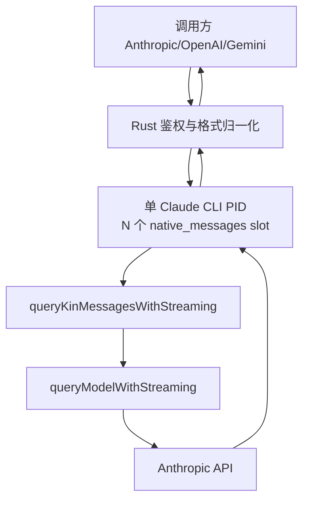

# Design — native_messages

## 1. 边界重划

### 现状（`native_agent` / e467415）

```
Rust Runtime ──kin_job_start──> NativeSlotRunner
                                  └─ QueryEngine (agent loop)
                                       ├─ 工具执行（宿主 + client stub）
                                       ├─ 权限 / hooks / 自动压缩 / maxTurns
                                       ├─ FileStateCache（跨 job 复用）
                                       └─ 客户端工具 → park 生成器 → 等 kin_tool_result
```

`QueryEngine` 承担了「谁执行工具」这一职责，于是需要 client tool stub、parking、cancel-ack 时序、job/slot 校验、宿主工具白名单——每一项都是缺陷来源。

### 目标（`native_messages`）



「谁执行工具」的答案变成：**调用方**。CLI 退化为带官方指纹的请求生成器。

## 2. 它不是字节级透明转发

`queryModelWithStreaming()` 会执行 `normalizeMessagesForAPI` / tool result 配对修复 / system layout 注入 / prompt caching / CLI beta+metadata / model normalization / retry。

这恰是我们要的「Claude Code 出站特征」，但必须明确字段所有权（见 prd.md R4）。设计上的落点：

- 调用方字段经 `kin_job_start.request` 进入，由薄封装显式映射到 `Options`
- CLI 字段完全不暴露给调用方，薄封装不提供覆写入口
- 控制台字段经进程 env 在 CLI 启动时固定，运行期不可变

## 3. CLI 侧薄封装

### 3.1 签名

```ts
// src/services/api/claude.ts
export async function* queryKinMessagesWithStreaming({
  messages, system, toolSchemas, toolChoice, thinking,
  maxTokens, temperature, topP, topK, stopSequences, model, signal,
}): AsyncGenerator<StreamEvent | AssistantMessage | SystemAPIErrorMessage, void>
```

内部：

```ts
yield* queryModelWithStreaming({
  messages: toEngineMessages(messages),
  systemPrompt: asSystemPrompt(system),      // layoutSystemBlocks() 产物
  thinkingConfig: thinking,
  tools: [],                                  // 关键：CLI 不持有任何 Tool
  signal,
  options: {
    model,
    extraToolSchemas: toolSchemas,            // 关键：调用方 schema 原样透传
    maxOutputTokensOverride: maxTokens,
    temperatureOverride: temperature,
    topP, topK, stopSequences,                // ← 需新增，见 §3.2
    getToolPermissionContext: async () => EMPTY_PERMISSION_CONTEXT,
    isNonInteractiveSession: true,
    hasAppendSystemPrompt: false,
    querySource: 'kin_native_messages',
    agents: [], mcpTools: [],
  },
})
```

已核实的依据：

| 断言 | 位置 |
|---|---|
| `allTools = [...toolSchemas, ...extraToolSchemas]`；`tools: []` 时出站 tools 严格等于调用方声明 | `claude.ts:1496` |
| 官方 WebSearchTool 自身即用 `tools: [] + extraToolSchemas`，是受支持用法 | `WebSearchTool/adapters/apiAdapter.ts:61` |
| `maxOutputTokensOverride` 生效路径 | `claude.ts:1676` |
| `temperatureOverride` 生效路径 | `claude.ts:1778` |
| `QuerySource = string`（自由文本，非封闭联合） | `constants/querySource.ts:6` |
| `asSystemPrompt` 是 `readonly string[]` 的 branded 包装 | `@ant/model-provider/src/types/systemPrompt.ts:8` |

### 3.2 `top_p` / `top_k` / `stop_sequences` 必须是真补丁

**不能走 `CLAUDE_CODE_EXTRA_BODY`**。`getExtraBodyParams()`（`claude.ts:282`）读的是进程级环境变量，单 PID 20 并发共享同一份，per-job 采样参数会互相串扰。

正确做法，两处改动：

```diff
// claude.ts:696 Options
   temperatureOverride?: number
+  topP?: number
+  topK?: number
+  stopSequences?: string[]

// claude.ts:1788 请求体构造
   ...(temperature !== undefined && { temperature }),
+  ...(options.topP !== undefined && { top_p: options.topP }),
+  ...(options.topK !== undefined && { top_k: options.topK }),
+  ...(options.stopSequences?.length && { stop_sequences: options.stopSequences }),
```

对应 AC15。

### 3.3 关闭非流式 fallback

`claude.ts:2589` 的判定：

```ts
const disableFallback =
  isEnvTruthy(process.env.CLAUDE_CODE_DISABLE_NONSTREAMING_FALLBACK) || <feature flag>
```

`native_messages` 启动时进程级设 `=1`。官方注释已说明该 fallback 会导致 tool_use 双重执行（inc-4258）；对我们还有第二重危害：用户看到整块正文而非逐 token（AC12）。

### 3.4 事件循环

```
for await (ev of stream):
  ev.type === 'stream_event' → writeStdout(kin_stream_event{job_id, slot_id, event: ev.event})
  ev.type === 'assistant'    → 记录 stop_reason / usage（不透传）
  ev.type === 'system'       → writeStdout(kin_job_error)，终止   // SystemAPIErrorMessage，判定见 claude.ts:932
generator 完全退出后 → writeStdout(kin_job_done{job_id, slot_id, stop_reason, usage})
```

`stop_reason=tool_use` 与 `end_turn` 走同一路径：都发 `kin_job_done`，槽都回 `idle`。区别只在字段值，由 Rust 决定是否等 continuation。

原生 SSE 的 `content_block_start{type:'tool_use'}` + `input_json_delta` 自带完整 `{id, name, input}`，逐帧透传即可 —— P1-2 自动消失。

## 4. 槽状态机

```
idle ──job_start(校验通过)──> running ──generator 退出──> idle
                                │
                                └──kin_cancel──> cancelling ──7 步完成──> idle
```

`cancelling` 是显式状态，不是 `running` 的子情形——Rust 在收到 `kin_cancel_ack` 前不得向该槽派活。

```ts
case 'kin_cancel': {
  const slot = slots.get(msg.slot_id)
  if (!slot || slot.jobId !== msg.job_id) return   // 步骤 2，修 P0-3
  if (slot.phase !== 'running') return
  slot.phase = 'cancelling'
  slot.abort?.abort()                               // 步骤 3
  await slot.task                                   // 步骤 4+5：generator 退出并释放 body
  slot.phase = 'idle'; slot.jobId = undefined       // 步骤 6
  await writeStdout({ type: 'kin_cancel_ack', ... })// 步骤 7，修 P0-2
}
```

`SlotState` 收窄为 `{ id, phase, jobId?, abort?, task? }`。`FileStateCache` 整体删除（P1-5 消失）。

`NativeHost` 收窄为 `{ options: { model?, thinkingConfig?, fallbackModel? } }`——不再需要 `tools`/`agents`/`commands`/`canUseTool`/`getAppState`/`setAppState`/`cwd`。`print.ts.hook.patch` 中写死的 `canUseTool: () => ({behavior:'allow'})` 随之删除。P0-1/P0-4/P0-5 一并消失。

## 5. Rust 侧

### 5.1 三模式

```rust
enum ExecutionMode { McpSlot, NativeAgent, NativeMessages }
```

`native_slot` 作为 `native_agent` 的别名保留以兼容既有配置。`NativeAgent` 需显式 opt-in 门禁（AC18）。

### 5.2 continuation 重设计

现状 `resume()` 靠 `SlotPhase::WaitingTool` 定位同槽 parked。新语义下：

```
resume(request, context):
  验证 continuation + tenant + generation
  验证 request 中全部 tool_use_id ⊆ pending_request 保存的 tool_use_id 集合
  messages = 客户端自带完整历史 ? 直接用 : merge(pending_request.messages, assistant_tool_use, tool_results)
  slot_id = scheduler.pick(...)                 // 任意空闲槽，sticky 优先
  write_cli_stdin(JobStart{job_id, slot_id, request: {messages, ...}})
```

`park_native_job()` 与 `SlotPhase::WaitingTool` 在此模式下完全不使用。

`pending_request` 存于 Rust（现有 `pending_call.rs` / `continuation.rs` 可复用），保存首回合的 `system/tools/messages` 与 assistant 的 tool_use blocks。

### 5.3 逐条修订

| 项 | 位置 | 动作 |
|---|---|---|
| P1-1 双 message_start | `mod.rs:1754` | emit 移入非 native 分支 |
| P1-3 HostReady 校验 | `mod.rs:1100` | 校验 protocol_version==2 / slots / system_layout / timezone / capabilities / **config_hash**；不符则 error 且不注册槽 |
| P1-4 MAX_JOB_BYTES | `mod.rs:2344` | 计量键改为 `parent_id(&frame).or_else(|| frame.get("job_id").and_then(as_str))` |
| P1-2 parked | `mod.rs:1194` | 删 `park_native_job()` |
| 协议 | `native_protocol.rs` | 删 `ToolResult`/`JobParked` variant 与测试；`HostReady` 加 `config_hash` |
| 诊断头 | `api.rs` | 响应加 `x-kin-native-slot: s00` |

### 5.4 StreamAssembler

从原生 SSE 累积真实 `{id, name, input}`（`content_block_start` + `input_json_delta` 拼接），供 `stream:false` 聚合与 continuation 校验使用。这同时是 OQ1 的落点。

## 6. Go 控制台 RuntimeProfile

```
execution_mode / system_layout / timezone / slot_count / socks5
allowed_models / allowed_server_tools / allowed_betas
max_body_bytes / max_output_tokens
```

对规范化 JSON（key 排序、无空白）算 `config_hash`：

```
Go 下发 desired hash
  → Rust /healthz 返回 applied hash
  → CLI kin_host_ready 回传同一 hash
  → 三者不一致 → /readyz 失败
```

变更流程固定为 drain → 重启单个 CLI PID → generation+1。禁止任务中途热改（Node/Intl 会缓存进程时区）。

## 7. 回滚

| 位置 | 动作 |
|---|---|
| 任意阶段 | `KIN_EXECUTION_MODE=mcp_slot`，该路径全程未动 |
| CLI 补丁 | worktree `git checkout src/kin src/services/api/claude.ts` |
| 协议 | v2↔v1 不兼容，Rust 与 CLI 须同步回滚 |

## 8. 风险

| 风险 | 缓解 |
|---|---|
| `queryModelWithStreaming` 内部读全局 appState（feature flag / model 选择） | 先跑单槽 hello 验证；若有硬依赖，最小 stub 注入而非引回 QueryEngine |
| `normalizeMessagesForAPI(messages, [])` 剥离 `tool_reference` block（`messages.ts:1839`） | 该 block 为 Claude Code 私有类型，第三方不发；在 AC4 验收中确认 |
| 20 并发共享 SDK client 连接池上限（OQ2） | 20 并发实测观察 socket 数与 `http_to_socks.py` 承载 |
| 失去服务端代执行工具能力 | 保留在 `native_agent` 模式，不对外暴露 |
