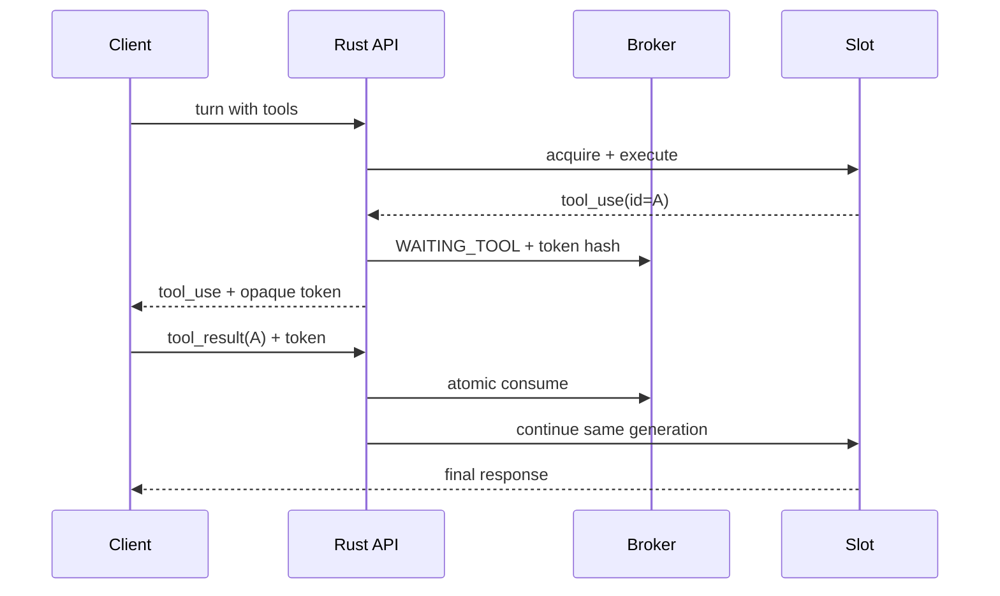

# API、会话与状态契约

## 1. 外部入口

本包演示两个同步 JSON 入口：

- `POST /v1/messages`：Anthropic 风格子集；
- `POST /v1/chat/completions`：OpenAI Chat 风格子集。

生产实现应补充 SSE 流式响应，但仍从同一 `TurnEvent` 流编码，不能分别维护两套 provider 逻辑。

### 通用请求头

| Header | 必需 | 说明 |
|---|---|---|
| `authorization` | 生产必需 | 客户到 Kin 的凭据，不透传给 provider |
| `x-tenant-id` | demo 可选 | 仅 demo；生产必须由认证中间件注入 |
| `x-request-id` | 建议 | 幂等/追踪；格式和长度受限 |
| `x-kin-session-id` | 多轮建议 | 会话粘性键，必须 tenant-bound |
| `x-kin-continuation` | tool_result 必需 | 单次 opaque continuation token |
| `idempotency-key` | 建议 | 重试去重；与 tenant、route 一起作为键 |

### 通用响应头

| Header | 说明 |
|---|---|
| `x-request-id` | 服务端确认的 request id |
| `x-kin-session-id` | 后续轮次复用 |
| `x-kin-continuation` | 仅 stop reason 为 tool_use 时出现 |
| `x-kin-slot` | demo/运维可见；公网生产建议移除 |
| `retry-after` | 429/503 时的退避建议 |

## 2. 错误模型

```json
{
  "type": "error",
  "error": {
    "code": "continuation_lost",
    "message": "the bound runtime is no longer available",
    "retryable": false,
    "request_id": "req_..."
  }
}
```

| HTTP | code | 典型原因 |
|---|---|---|
| 400 | `invalid_request` | schema、tool_result、model 参数错误 |
| 401 | `unauthenticated` | 客户凭据无效 |
| 403 | `policy_denied` | tenant/model/tool/egress 策略拒绝 |
| 409 | `continuation_mismatch` | token、tool id、phase 或 generation 不符 |
| 409 | `continuation_lost` | stateful runtime 已重启且不能恢复 |
| 429 | `rate_limited` / `overloaded` | tenant/provider/queue 上限 |
| 499 | `client_cancelled` | 客户端取消（日志语义，HTTP 实际可能断连） |
| 502 | `provider_error` | 上游可归因错误 |
| 503 | `no_capacity` | 无兼容 slot 或 Redis fail-closed |
| 504 | `deadline_exceeded` | queue/first byte/total deadline |

错误消息不得包含 provider token、完整上游 body 或用户 prompt。

## 3. Session record

Redis key 建议：`kin:sess:{tenant_hash}:{session_id}`。值使用 msgpack/protobuf，而非可被脚本随意拼接的散乱字段。

```json
{
  "schema_version": 1,
  "tenant_id_hash": "t_...",
  "session_id": "s_...",
  "route_key": "anthropic/opus/default",
  "slot_id": "kernel-a/slot-07",
  "slot_generation": 42,
  "phase": "waiting_tool",
  "tool_use_ids": ["toolu_123"],
  "transcript_version": 8,
  "policy_revision": 19,
  "expires_at_unix_ms": 1787790000000
}
```

### CAS 规则

1. `READY -> RUNNING`：请求拿到执行 lease。
2. `RUNNING -> WAITING_TOOL`：响应包含 tool use，写入允许的 tool ids 与 token hash。
3. `WAITING_TOOL -> RUNNING`：token、tenant、tool ids、generation 全匹配；原子标记 token consumed。
4. `RUNNING -> READY`：turn 正常结束并刷新 sticky TTL。
5. 任意状态到 `EXPIRED`：TTL/cancel/kernel fencing；释放 reservation。

Redis Lua/事务必须同时更新 session 和 slot reservation，避免进程崩溃产生永久占用。后台 sweeper 只是补偿，不是正确性的主要手段。

## 4. Slot record

| 字段 | 类型 | 说明 |
|---|---|---|
| `slot_id` | string | kernel 内稳定 id |
| `generation` | uint64 | 每次 runtime 重建递增 |
| `provider` | enum | adapter 名称 |
| `models` | set | 支持 model family |
| `capacity` | uint32 | 逻辑并发上限，不等于进程数 |
| `active` | uint32 | 正在生成/执行 |
| `waiting_tool` | uint32 | 保留 runtime 等待客户结果 |
| `queued` | uint32 | 有界等待 |
| `health` | enum | healthy/degraded/unhealthy |
| `draining` | bool | 不接新会话，已有 sticky 可按策略继续 |
| `capabilities` | set | streaming/resume/multiplex/native_tool_wait/cancel_receipt |

## 5. Tool loop 时序



安全断言：

- continuation token 不能用作认证；仍需客户凭据。
- token 只绑定一个 tenant、session、generation 和 tool set。
- tool_result 不得加入未请求的 tool id。
- token TTL 小于 session TTL；默认建议 10 分钟，可按工具类型调整。
- slot drain 时已有 `WAITING_TOOL` 可等到短 deadline，随后显式取消。

## 6. 控制面 API

demo 控制面暴露：

- `POST /api/v1/kernels`：注册/更新 observed state；
- `POST /api/v1/kernels/{id}/heartbeat`；
- `POST /api/v1/kernels/{id}/drain`；
- `GET /api/v1/kernels`；
- `PUT /api/v1/route-policies/{name}`；
- `GET /api/v1/route-policies/{name}`；
- `GET /api/v1/snapshots/current`；
- `POST /api/v1/reconcile`；
- `GET/PUT /api/v1/config/routing`；
- `GET/PUT /api/v1/config/model-policy`；
- `GET/PATCH /api/v1/slots/{id}`、`POST /api/v1/slots/policy`；
- `GET/PUT /api/v1/config/proxy-pool` 与 `/api/v1/proxies*`（密文 kind=`proxy-auth`）；
- `GET/PUT /api/v1/migration/domains/{domain}`；
- `POST /api/v1/operations`、claim、complete。

`KIN_CONTROL_INTERNAL_TOKEN` 为空时 `/api/v1` 不鉴权（旧 demo）。非空则除 `/healthz` 外需要 `Authorization: Bearer`。`KIN_DB_SECRET` 为空时 secret 写入/reveal 返回 `secret_unavailable`。默认 `inference.engine=go`。

生产 API 必须位于管理网络并使用 mTLS/RBAC；公开客户不能调用注册、drain 或快照接口。

## 7. 配置快照

快照不可变并含以下 envelope：

```json
{
  "revision": 19,
  "issued_at": "2026-08-27T00:00:00Z",
  "expires_at": "2026-08-28T00:00:00Z",
  "payload_sha256": "...",
  "key_id": "config-signing-2026-08",
  "signature": "base64url...",
  "payload": {}
}
```

kernel 应先校验 schema、hash、签名、时间窗和 revision 单调性，再原子替换 active config。失败时继续使用 last-known-good 并上报告警，不能应用半份配置。

