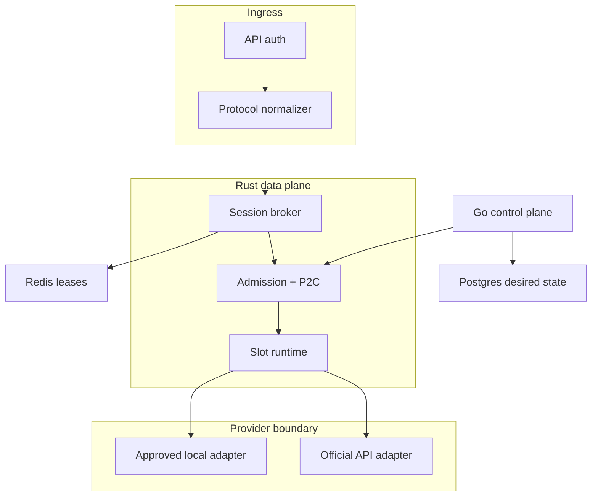
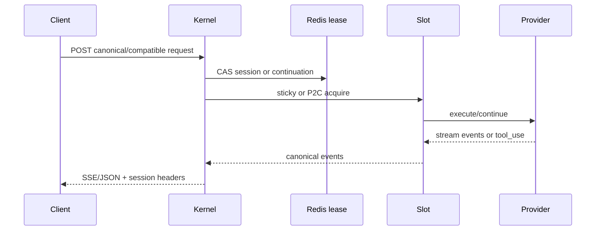
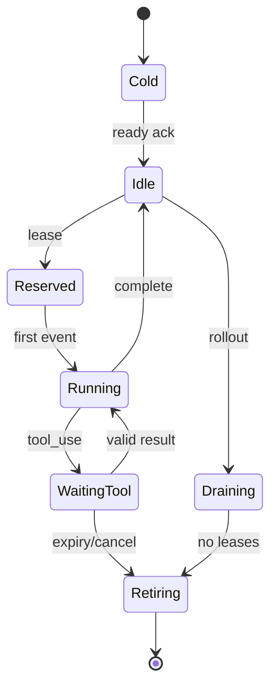

# Kin Gateway v2 完整技术架构

## 1. 设计目标

本架构针对以下已验证现状重新划分边界：

- 89 个 OS 进程不等于 89 并发；`--max-procs=20` 表示每个运行时内部最多 20 个逻辑 request slot。
- Rust 网关承担粘性、P2C 和负载感知；worker runtime 承担进程驱动、协议转译与 agent loop 生命周期。
- 外部 HTTP 是一轮一请求，内部 agent loop 可能跨工具调用长期存活；两者之间需要 continuation broker。
- 推理链路与凭据开通链路必须分离，凭据不应成为数据面可读的业务对象。

目标是保留上述可复用机制，并做到：

1. 数据面低延迟，控制面故障不影响已有流量。
2. slot、进程和 HTTP 并发三个概念分离并可观测。
3. 支持 Anthropic、OpenAI 风格入口，但内部只维护一种 canonical turn schema。
4. stateful loop 与 stateless Messages API 对客户端暴露相同 continuation 契约。
5. 默认严格租户隔离，凭据只通过 secret reference 使用。
6. provider 的未公开能力必须通过 capability negotiation，而不是写死版本或进程参数。

## 2. 现网机制到新架构的映射

| 现网角色/机制 | v2 模块 | 处理方式 |
|---|---|---|
| `portunex-server` | Rust `Ingress + Scheduler` | 保留粘性、P2C、负载分数、drain |
| `isthmus` | `ProviderAdapter + SlotRuntime` | 公开 trait；实现能力协商和生命周期状态机 |
| 单进程 N subagent slot | `multiplex_slots` capability | 仅适配器明确声明后启用；不是通用 Claude CLI 假设 |
| `continuous-tool-loop` | `ContinuationBroker` | opaque token + tenant/session/slot generation CAS |
| `--one-shot process` | `IsolationMode::ProcessPerTurn` | 高隔离，适合不信任工具或高价值租户 |
| `session-reset` | `IsolationMode::ResetAndReuse` | 需要适配器提供可验证 reset ack |
| `subagent-pool` | `IsolationMode::Multiplexed` | 仅同租户或同信任域；强制配额与超时 |
| `auth.sh` / 换票 | `Credential Broker` | 改为官方 API key/WIF/批准 OAuth；数据面只拿短期 secret handle |
| 89 条 SNAT | 标准 egress gateway | 仅用于固定出口、审计和 allowlist，不用于身份规避 |

## 3. 逻辑拓扑



### 3.1 Rust 数据面 `kin-kernel`

Rust 只做请求热路径和必须与运行时同生命周期的状态：

- API auth：验证客户 API key/JWT/mTLS，生成不可伪造的 `tenant_id`。
- Protocol normalizer：Anthropic/OpenAI/Gemini 子集转为 `CanonicalTurn`。
- Admission controller：tenant 并发、RPM、token budget、队列上限和 body 上限。
- Session directory：维护 `tenant + session -> slot + generation + phase`。
- Scheduler：兼容性过滤后做 sticky-first、P2C 选择和 circuit breaker。
- Slot runtime：启动/停止/中断 provider，跟踪 active、waiting_tool、queue 和 EWMA。
- Continuation broker：把无状态 HTTP tool_result 原子绑定回等待中的 loop。
- Stream translator：canonical event 与 SSE/JSON 协议之间转换。
- Config subscriber：只接收带版本、签名和有效期的不可变快照。
- Observability：OpenTelemetry trace、Prometheus metrics、结构化审计事件。

### 3.2 Go 控制面 `kin-control`

Go 负责变化频率低、需要一致性和运维编排的能力：

- kernel/slot group 注册、心跳与 observed state；
- route policy、model alias、tenant quota、isolation policy；
- desired-state reconciliation、drain、升级和容量计划；
- credential reference 与租约策略，不存明文 token；
- signed config snapshot 生成与灰度发布；
- audit、usage rollup、SLO 和告警规则；
- autoscaler：根据 queue delay、reserved slots、provider rate-limit headroom 决策。

控制面不得同步代理每个推理请求。数据面只通过 watch/长轮询接收版本化快照，并保留 last-known-good。

### 3.3 状态存储

| 存储 | 数据 | 一致性/TTL |
|---|---|---|
| Postgres | desired state、route policy、tenant、audit、snapshot metadata | 强一致、长期 |
| Redis | session lease、continuation、idempotency、分布式 rate bucket | CAS/Lua，分钟到小时 TTL |
| Secret manager | provider API key/WIF 配置、签名密钥 | 加密、审计、短租约 |
| Object storage（可选） | 大型审计归档、离线 usage | 不在请求热路径 |

本地 demo 用内存 store；生产 profile 必须启用 Redis/Postgres/secret manager。

## 4. 请求路径



详细步骤：

1. 验证入口身份，将 tenant 从认证上下文写入，拒绝接受 body 中自报 tenant。
2. 解析协议并设置大小、工具数量、token 上限。
3. 计算 `route_key = tenant/provider/model_family/policy_revision`。
4. 若带 continuation，执行一次 Redis CAS：验证 tenant、session、tool_use_id、slot generation、expiry 和 phase。
5. 否则先尝试现有 sticky slot；不可用时才进入 P2C。
6. 适配器执行并输出 canonical events；首字节后不做跨 provider 自动重试。
7. 遇到 `tool_use`：
   - stateful adapter 将内部 loop 保持在 `WAITING_TOOL`；
   - stateless API adapter 持久化规范化 transcript，不保留进程；
   - 两者都返回 opaque continuation token。
8. 下一轮 tool_result 原子消费 token，进入同一逻辑会话。
9. 成功结束后刷新 sticky TTL；取消、超时或 drain 按状态机清理。

## 5. Canonical Turn

内部模型不能直接复用任一供应商 JSON，否则协议兼容层会侵入调度和会话代码。核心对象包括：

- `TurnRequest`：tenant、request id、session id、model intent、messages、tools、sampling、stream、deadline。
- `ContentBlock`：text、image reference、tool use、tool result、thinking summary（受策略控制）。
- `TurnEvent`：start、content delta、tool start/delta/end、usage、retry notice、end、error。
- `ProviderCapabilities`：streaming、resume、multiplex slots、native tool wait、cancel receipt、max context。
- `ExecutionContext`：slot id/generation、credential handle、deadline、trace context、egress policy。

兼容层必须记录 lossiness，例如 OpenAI `tool_calls` 到 Anthropic `tool_use` 的字段差异；无法无损表达时返回明确的 `unsupported_feature`，不能静默删除。

## 6. Slot 与进程模型

“一个 OS 进程有多少并发”由 adapter capability 决定，不能由 `ps` 推导。



每个 slot 有单调递增 `generation`。进程重启或 reset 后 generation 改变，旧 continuation 即使 token 未过期也必须失败，返回 `409 continuation_lost`。

三种隔离模式：

| 模式 | 进程/slot 关系 | 适用场景 | 约束 |
|---|---|---|---|
| ProcessPerTurn | 每 turn 新进程 | 不信任代码、高隔离 | 冷启动最大；需 warm spare |
| ResetAndReuse | 一个 slot 顺序复用进程 | 单租户批处理 | reset 必须有可验证 ack |
| Multiplexed | 一个 runtime 多逻辑 slot | 高密度、同信任域 | adapter 明确支持；禁止跨不可信租户共享 session |

默认策略为：官方 HTTP API adapter 使用异步连接池；本地 CLI adapter 使用 `ProcessPerSession`，只允许单租户、`--bare`、显式 tool allowlist。未公开的单进程 subagent 复用不作为 Claude CLI 的稳定承诺。

## 7. 调度算法

### 7.1 候选过滤

先按硬条件过滤：

- healthy 且不 draining；
- provider/model/capability 匹配；
- isolation domain 与 tenant 匹配；
- credential handle 有效；
- `active + reserved < capacity`；
- circuit breaker 未打开；
- 所需 egress 和 tool policy 可用。

### 7.2 Sticky + P2C

有效 sticky binding 优先，避免 state migration。没有 binding 时从候选中取两个，选择分数更低者：

\[
score = 0.35U + 0.20Q + 0.15L + 0.15E + 0.10C + 0.05R
\]

其中：

- \(U\)：`(active + reserved_waiting) / capacity`；
- \(Q\)：队列占用比；
- \(L\)：p95/目标延迟；
- \(E\)：近期错误 EWMA；
- \(C\)：模型冷启动/缓存未命中惩罚；
- \(R\)：provider rate-limit 压力。

权重由控制面快照下发。分数只在同一兼容候选集合内比较；不能让低分但能力不匹配的 slot 被选中。

### 7.3 背压

每个 tenant、route 和 kernel 都有有界队列。超过 queue deadline 返回 `429 overloaded` 和 `retry-after`。不允许无限排队，也不允许控制面通过盲目增加逻辑 slot 掩盖 provider TPM/RPM 上限。

## 8. 连续工具调用

Continuation 记录至少包含：

| 字段 | 含义 |
|---|---|
| tenant_id | 防止跨租户接管 |
| session_id | 客户可见会话标识 |
| slot_id + generation | 精确绑定运行时实例 |
| tool_use_ids | 当前允许返回的工具调用集合 |
| transcript_version | stateless adapter 的 CAS 版本 |
| phase | 仅 `WAITING_TOOL` 可消费 |
| expires_at | 防止永久占 slot |
| opaque_token_hash | token 只返回一次，存 hash |

一个 token 只允许成功消费一次。重复 tool_result 返回同一个幂等结果或 `409 already_consumed`，由 idempotency key 决定。多工具并行时，策略必须声明是 `all_results` 还是 `partial_results`，不可猜测。

## 9. Provider adapter

`Provider` trait 的职责：

```text
capabilities() -> ProviderCapabilities
execute(turn, context) -> stream<TurnEvent>
continue(turn, continuation, context) -> stream<TurnEvent>
cancel(execution_id) -> CancelReceipt
health() -> ProviderHealth
```

推荐实现顺序：

1. `mock`：本包已实现，用于契约与状态机测试。
2. `anthropic_api`：本包含正式 Messages API 的非流式参考实现，使用 API key；生产版补 WIF、SSE、完整 content block 与 rate-limit 指标。
3. `openai_api`：正式 Responses/Chat API，映射 canonical events。
4. `local_cli`：只在用户自有、单租户、明确批准的自动化场景启用；`--bare -p`、API key、工具白名单、工作目录沙箱。

每个适配器必须输出 capability，不允许主程序通过版本字符串猜特性。Claude Code 的 `system/init.capabilities` 也应做 feature detection，而不是写死版本号。

## 10. 凭据架构

凭据流程与推理解耦：


规则：

- 控制面数据库仅保存 `secret_ref`、scope、owner、expiry 和 rotation policy。
- kernel 使用 workload identity 换取短期 secret lease；日志永不打印 secret。
- access token 只在 adapter 的受限内存中存在，不进入请求、trace baggage 或 metrics label。
- refresh 由 credential broker 单独执行，采用 singleflight + fencing token，避免并发刷新撤销彼此。
- 任何 cookie/sessionKey 导入、浏览器指纹模拟、非公开 scope 拼装都不属于本服务包。

## 11. 网络与部署

生产建议每个节点运行多个 kernel pod，而非每个凭据一个完整网关：

- ingress 到 kernel：mTLS/JWT，HTTP/2 或 HTTP/3 可选；
- kernel 到 Redis：TLS、AUTH、独立 ACL；
- kernel 到 provider：固定 egress gateway + 域名/IP allowlist；
- control 到 kernel：mTLS 配置 watch；
- kernel 不暴露宿主机 Docker socket，不允许任意代理地址。

SNAT 的合法用途是固定出口和供应商 allowlist。不能把公网 IP 轮换作为账号关联规避或配额扩展手段。

## 12. 高可用与失败语义

| 故障 | 行为 |
|---|---|
| Go control 故障 | kernel 使用 last-known-good snapshot；禁止新策略发布 |
| Postgres 故障 | 不影响已有数据面；控制面写入失败 |
| Redis 短故障 | 已在本地运行的 turn 继续；新 continuation fail closed；可配置仅无状态流量降级 |
| kernel 崩溃 | API adapter 会话可由 transcript 恢复；本地 stateful loop 返回 `continuation_lost` |
| provider 429 | 尊重 `retry-after`，更新 rate pressure，限流而非扩 slot |
| provider 5xx/网络失败 | 首字节前有限重试；首字节后终止并返回可判断错误 |
| tool wait 超时 | cancel loop、释放 reserved slot、token 失效 |

禁止对非幂等请求做不透明的跨账号/跨 provider 重放。

## 13. 可观测性

关键 metrics：

- `kin_http_requests_total{tenant,protocol,route,status}`（tenant 应哈希或低基数）；
- `kin_slot_state{group,state}`；
- `kin_slot_wait_seconds`、`kin_queue_seconds`、`kin_first_token_seconds`；
- `kin_continuation_total{result}`、`kin_continuation_age_seconds`；
- `kin_provider_rate_pressure{provider,model}`；
- `kin_scheduler_decisions_total{reason}`；
- `kin_config_revision`、`kin_snapshot_apply_total{result}`。

日志中只放 request id、trace id、tenant surrogate、slot id/generation、policy revision、stop reason。prompt、tool payload、凭据默认不记录。

## 14. 技术基线

- Rust 1.98（2026-08-20 stable），edition 2024；Tokio + Axum 数据面。
- Go 1.27（2026-08-19 stable）；标准库 HTTP demo，生产可替换为 Connect/gRPC。
- Postgres 17+、Redis 7.4+；版本在正式落地时按组织支持矩阵固定。
- OpenTelemetry/Prometheus；容器以 non-root、read-only rootfs 运行。

## 15. 官方依据

- Claude Code 官方“Run programmatically”说明 `--output-format stream-json`、session resume 和 capability feature detection，并指出 `--bare` 不读取 OAuth 凭据而使用 API key：<https://code.claude.com/docs/en/headless>
- Claude API 官方概览说明正式访问前置条件为 API key 或 Workload Identity Federation：<https://docs.anthropic.com/api/overview>
- Anthropic Messages API 官方 SSE 事件说明：<https://docs.anthropic.com/api/streaming>
- Anthropic 官方 rate limits 说明 RPM/ITPM/OTPM 和 `retry-after`：<https://docs.anthropic.com/api/rate-limits>
- Rust 1.98 官方发布：<https://blog.rust-lang.org/2026/08/20/Rust-1.98.0/>
- Go 官方 release history：<https://go.dev/doc/devel/release>

## 16. 明确不做

- 不把消费级订阅额度包装成多租户转售 API。
- 不实现 sessionKey 换票、token 抓取、UA/TLS 指纹伪装。
- 不通过关闭或伪造遥测、metadata、source IP 来规避关联。
- 不把 MITM 代理放入生产推理链路；测试抓包只能使用合成凭据和脱敏数据。
- 不承诺“89 进程 = 1780 可用并发”；容量必须以队列延迟、provider 限额和压测结果校准。
