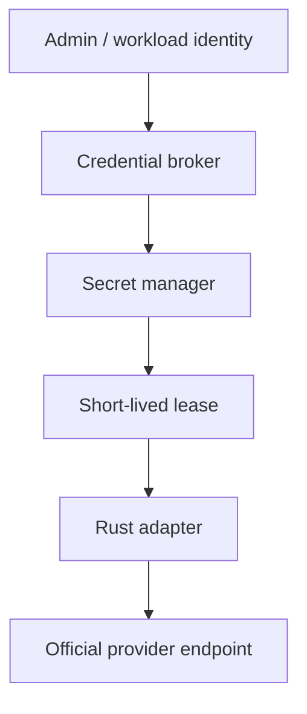
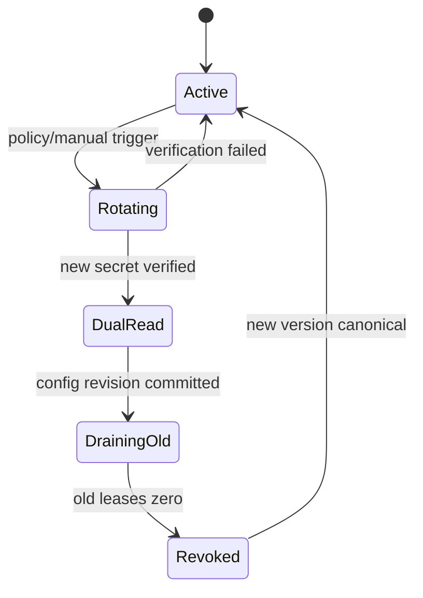

# 凭据服务设计

## 1. 对现有“换票”链路的判断

附件中的链路把浏览器会话 cookie 依次送到 authorize、token、bootstrap 和账号设置接口，并刻意对齐浏览器/SDK/CLI 身份特征。这是一条实验性、与消费账号状态紧耦合的登录复现链路，不适合固化为多租户基础设施：

- sessionKey 的权限和生命周期远大于一次推理请求；
- refresh/access token 相互撤销时会产生竞态；
- UA、TLS、scope 和非公开接口随客户端版本变化，无法形成稳定契约；
- 账号身份、source IP、metadata 与遥测规避会形成合规和封禁风险；
- 同一凭据的多份文件副本容易产生“哪份是真源”的一致性问题。

因此 v2 不复制该五步换票。`POST /internal/v1/credentials/import-session-key` 固定返回 410。

可复用的是“推理面只消费最终短期 lease、刷新面单独 singleflight、写入必须原子”的工程原则。

### 1.1 CLI 路径上的正式换票

本地 Claude Code 转发把换票拆成两段，都不碰 cookie：

1. **凭据面**：两条官方 CLI 票都可以交给 kernel，**不要混用**。
   - **订阅 OAuth**（`claude auth login` / `/login`）：secret 是 `claudeAiOauth` 整包（accessToken + refreshToken + expiresAt + 全 scope）。Kernel 写隔离 `CLAUDE_CONFIG_DIR/.credentials.json`（0600），**不**设 `CLAUDE_CODE_OAUTH_TOKEN`，子进程自己 refresh。
   - **setup-token**（`claude setup-token`）：inference-only，`refreshToken` 为空，`scopes=['user:inference']`。Kernel 注入 `CLAUDE_CODE_OAUTH_TOKEN`（CLI 官方用法）。可经 `KIN_CLAUDE_CODE_OAUTH_TOKEN`，或 `KIN_CLAUDE_AI_OAUTH_JSON` 里 `kind=setup-token` / 空 refresh / sub2api `type=setup-token` 导出。导出串若粘了 “Store this token securely” UI 文案，kernel 会裁到 `…AA`。setup-token **不能 refresh**、没有 `user:sessions:claude_code` / `user:mcp_servers` / `user:file_upload`；本地 `--mcp-config` HTTP MCP 仍可用，Remote Control 不可用。
   - **不**加 `--bare`（那是 API key）。换票（仅订阅票的 `refresh_token`）和用票绑同一条 SOCKS5。`POST /api/v1/credentials/exchange` 带 `session_key` 固定 410。
2. **请求面**：`x-kin-continuation` 把下一跳 HTTP 绑到同一 pid 的 stdin（mock）或 MCP `result.json`（真 CLI）。进程 SIGTERM 后 generation +1，continuation 失效为 `continuation_lost`。

`--bare` 是官方脚本路径，只吃 API key。订阅 OAuth 只允许本机/单操作员的 setup-token，不把一个 Pro 座卖成多租户 API。

## 2. 正式凭据架构



### 控制面保存的 metadata

```json
{
  "credential_id": "cred_prod_anthropic_01",
  "tenant_id": "tenant-a",
  "provider": "anthropic_api",
  "secret_ref": "vault://kin/prod/tenant-a/anthropic",
  "auth_mode": "api_key",
  "allowed_models": ["claude-sonnet-*"],
  "status": "active",
  "version": 12,
  "expires_at": null,
  "rotation_policy": "30d"
}
```

永远不含 access token、refresh token、session cookie 或代理密码。

### 数据面 lease

kernel 以自身 workload identity 请求：

```text
Lease(credential_id, kernel_id, route_id, ttl <= 15m)
  -> lease_id, secret_handle, expires_at, fencing_token
```

secret value 直接进入 adapter 的敏感 header，不经过 Go API、Redis session、业务 JSON 或日志。lease 到期后从内存清零并重新领取。

## 3. 轮换状态机



规则：

- 同一 credential 只允许一个 rotation leader；使用 fencing token，不靠文件锁。
- 新 secret 先做不含用户内容的健康验证，再发布配置 revision。
- 首字节后的请求继续使用原 lease 完成，不在中途换 credential。
- old lease 数归零或到 hard deadline 后才 revoke。
- rotation 失败保持旧版本 canonical，不写“半套”凭据。

## 4. 一致性

现网的 `credentials.json`、CLI 副本和 VM metadata 多份同步，应改为：

- Secret manager 是 secret value 的唯一真源；
- Postgres 是 credential metadata 的唯一真源；
- kernel 内存只持短期 lease，不落本地文件；
- route snapshot 只引用 `credential_id + version`；
- DB 中不存在 token 列，避免 NULL/非 NULL 双轨逻辑。

若某个官方 CLI 确实必须读取文件，credential broker 通过 tmpfs 写一次性文件：0600、单 runtime namespace、lease 到期删除，且不能挂载到其他 tenant。

## 5. Refresh 与故障处理

只有供应商正式 OAuth 流才启用 refresh：

1. 读取当前 version 与 refresh lease。
2. 取得 singleflight leader + fencing token。
3. 调官方 token endpoint。
4. 在一次 secret-manager compare-and-swap 中写新版本。
5. 发布 metadata revision；旧 access lease 自然 drain。

错误分类：

| 错误 | 行为 |
|---|---|
| transient network/5xx | 有界退避，保持旧 lease |
| invalid_grant | credential quarantine，停止新流量，要求管理员重新授权 |
| revoked/401 | 断路并告警，不切换到历史 cookie/token |
| secret store conflict | fencing loser 放弃，不覆盖新版本 |
| scope/model mismatch | 策略错误，禁止请求进入数据面 |

## 6. 审计字段

允许记录：credential id、version、lease id hash、kernel id、route id、operator/workload identity、动作、结果、时间。禁止记录 secret、完整 header、cookie、请求内容和代理密码。

