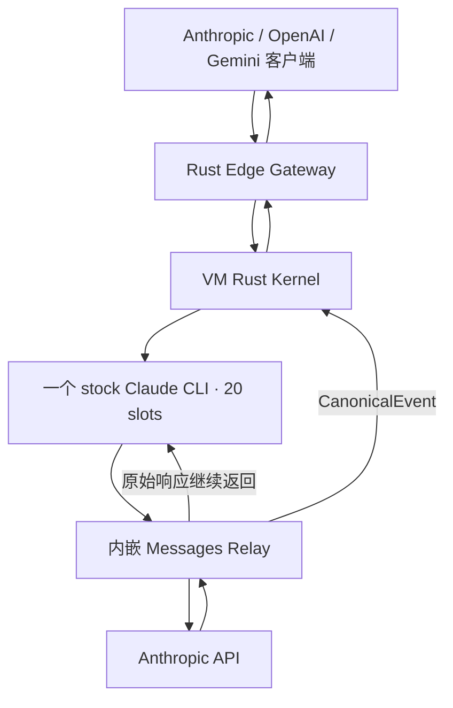
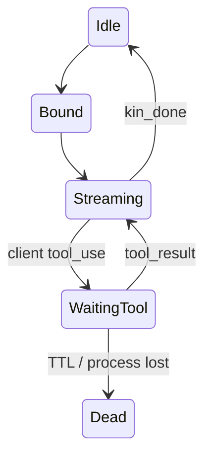

明白。基于最初原型和当前业务，正确方向是：

> 保留服务器 stock Claude CLI 作为请求生成器和 Agent 状态机；增加 Rust Messages Relay，直接从 Anthropic SSE 生成用户流；CLI stdout 仅做控制和兜底。

不改变原型核心，只修复当前代码没有实现的部分。

## 一、现有附件的验证结论

我已经运行当前可执行测试：

- Node 连续工具循环：6/6 通过
- `tool_use → 同 PID 等待 → tool_result 恢复`：通过
- continuation CAS 错配：通过
- 中途杀进程后 continuation 失效：通过
- 79 个文件静态校验：通过
- 当前环境没有 Cargo 和 Go，无法执行这两组测试

代码审查发现三个关键差距。

### 1. 还不是真正单 PID 多 slot

当前 `local_[cli.rs](http://cli.rs)` 是：

```rust
struct Parked {
    child: Child,
}

struct SessionTable {
    parked: HashMap<String, Parked>,
}
```

每个 session 都会创建一个 `Child`。所谓 `subagent-pool` 实际是“最多 N 个 Claude 进程”。

所以：

```text
5 并发 × 约 210MB = 约 1GB
```

完全符合当前实现。

仅增加：

```bash
--agents ...
```

只是注册 Agent 定义，并没有创建一个 PID 内的 20 个持久 slot。

### 2. Node SSE 仍然是请求结束后整包返回

当前 `http.mjs` 先：

```javascript
const result = await nodeKernel.execute(...)
```

然后把事件放进数组：

```javascript
chunks.push(...)
return new Response(chunks.join(""))
```

这不是实时 SSE，而是完成后伪装成 SSE。

### 3. Rust 热路径大量使用无界队列

当前存在：

```rust
unbounded_channel()
UnboundedSender
UnboundedReceiver
```

20 并发加慢客户端时会持续堆积内存。Messages Relay 加入前必须先改成有界流。

## 二、还原原型后的完整架构

建议恢复为三层服务，而不是把所有职责堆进一个 provider。



### Rust Edge Gateway：对应 portunex-server

负责：

- Base URL 和 Key 鉴权
- Anthropic/OpenAI/Gemini 入参转换
- sticky session
- P2C 节点选择
- continuation 定向路由
- 将 Kernel 的统一事件编码成客户端协议

### Rust VM Kernel：对应 isthmus

每台 VM 一个：

- 管理唯一 Claude PID
- 维护 20 个 Subagent slot
- stdin/stdout 常驻读写
- `slot_wait`
- `kin_done`
- 连续工具循环
- Job、Turn、Slot 状态关联
- 内嵌 Messages Relay
- Canonical stream 输出

### Go Control

不进入推理热路径，只负责：

- VM 注册和心跳
- 凭据租约
- 账号与出口分配
- drain/rotation
- 容量和路由策略
- 配置快照

## 三、Anthropic SSE 的最佳处理方式

明确采用：

> 双消费者、单一权威源。

“单一权威源”是 Anthropic upstream SSE。

“两个消费者”是：

1. stock Claude CLI：维持内部 Agent 状态。
2. Rust StreamCoordinator：生成用户逐 token 响应。

```text
Anthropic SSE
├── 返回 Claude CLI
└── Rust 解析 → CanonicalEvent → 用户
```

### 不再使用 Claude stdout 作为正文来源

stdout 仅处理：

- `system/init`
- Agent/slot 关联
- MCP 调用状态
- `kin_done`
- stop reason 校验
- usage/final digest
- 异常
- upstream tap 失败时的正文 fallback

优先级：

```text
Anthropic upstream text_delta
    > Claude stdout stream_event
    > assistant 完整帧 fallback
```

这样不会重复输出。

## 四、统一流事件

Relay 不直接把 Anthropic 字节交给所有用户，因为还要支持 OpenAI/Gemini。

内部统一为：

```rust
enum CanonicalEvent {
    TurnStart,
    TextDelta,
    ThinkingDelta,
    CitationDelta,

    ServerToolStart,
    ServerToolDelta,
    ServerToolResult,

    ClientToolCall,
    Usage,
    TurnStop,
    Error,
    Ping,
}
```

输出转换：


| CanonicalEvent    | Anthropic             | OpenAI          | Gemini              |
| ----------------- | --------------------- | --------------- | ------------------- |
| `TextDelta`       | `text_delta`          | `delta.content` | `text` part         |
| `ClientToolCall`  | `tool_use`            | `tool_calls`    | `functionCall`      |
| `ServerToolStart` | `server_tool_use`     | 扩展事件            | function/tool event |
| `Usage`           | `message_delta.usage` | usage chunk     | usageMetadata       |
| `TurnStop`        | `message_stop`        | `[DONE]`        | finishReason        |


Anthropic入口可以最大程度保留事件；OpenAI/Gemini实时转换。

## 五、单 PID 20 slot 的 Rust 结构

当前 `SessionTable<String, Parked>` 必须整个替换。

```rust
struct ClaudeRuntime {
    child: Child,
    stdin_tx: mpsc::Sender<RuntimeCommand>,
    generation: AtomicU64,
    slots: Vec<Slot>,
    jobs: JobRegistry,
}

struct Slot {
    slot_id: SlotId,
    agent_id: Option<AgentId>,
    model_pin: Option<Model>,
    state: SlotState,
    loop_id: Option<LoopId>,
    current_turn: Option<TurnId>,
}

enum SlotState {
    Booting,
    Idle,
    Bound,
    Streaming,
    WaitingTool,
    Draining,
    Dead,
}
```

唯一 stdout reader：

```rust
async fn decode_stdout(
    stdout: ChildStdout,
    jobs: Arc<JobRegistry>,
    slots: Arc<SlotManager>,
)
```

任何 HTTP handler 都不能直接读取 Claude stdout，否则 20 个 handler 会竞争同一个字节流。

所有 stdout frame 必须由一个 reader 解码后按以下字段路由：

```text
agent_id
parent_tool_use_id
slot_id
loop_id
turn_id
tool_use_id
```

## 六、Messages Relay 应该内嵌在 Kernel

不建议单独部署第三个 Relay 服务。

Kernel 同时监听：

```text
0.0.0.0:8765       外部/Edge 请求
127.0.0.1:18082    Claude Messages Relay
127.0.0.1:18083    MCP bridge
```

Claude 环境：

```bash
ANTHROPIC_BASE_URL=http://127.0.0.1:18082
```

Relay 做：

```rust
while let Some(chunk) = upstream.next().await {
    let bytes = chunk?;

    // Claude 必须继续收到响应
    cli_response.send(bytes.clone()).await?;

    // 用户流不等待 stdout
    upstream_tap.feed(request_context, &bytes).await?;
}
```

它不能重构 Claude 发出的 Messages body，只做：

- 接收 Claude 原生请求
- 识别对应 slot/turn
- 转发 method/path/headers/body
- 获取 Anthropic SSE
- 复制和解析响应

## 七、20 条 upstream 请求如何避免串流

这是还原原型时最关键的关联点。

推荐沿用原型的 `slot_wait` 请求信封：

```json
{
  "kin_context": {
    "loop_id": "loop_xxx",
    "turn_id": "turn_xxx",
    "slot_id": 7,
    "lease_epoch": 193,
    "signature": "..."
  },
  "request": {
    "messages": [],
    "tools": []
  }
}
```

Subagent 收到 `slot_wait` 结果后，下一次 `/v1/messages` body 会携带这个信封。

Relay 从请求中识别：

```text
loop_id → 当前外部会话
turn_id → 当前 HTTP 响应
slot_id → Subagent slot
lease_epoch → 防止复用旧任务
```

没有有效信封的请求视为：

- root Agent 控制请求
- slot 初始化请求
- idle/maintenance 请求

这些请求只返回 Claude CLI，不进入用户流。

## 八、连续工具循环继续保留

现有 Node 测试证明的语义是正确的，应原样迁移到 Rust：

```text
客户端请求
→ slot_wait 绑定
→ Claude/Anthropic
→ client tool_use
→ MCP bridge 挂起
→ 当前 HTTP 返回 tool_use
→ 客户端执行
→ 下一请求带 tool_result
→ continuation CAS
→ 先绑定新 JobStream
→ 再解除 MCP wait
→ 原 Agent loop 继续
```

重要的是先绑定新的用户 SSE sink，再释放 `tool_result`，否则恢复后的首 token 可能在新 HTTP 流建立前产生。

状态：



## 九、不同事件的权威来源


| 事件              | 权威来源                     |
| --------------- | ------------------------ |
| 正文 token        | upstream SSE             |
| thinking        | upstream SSE             |
| WebSearch 调用和结果 | upstream SSE             |
| 客户端工具调用         | MCP bridge + upstream 辅助 |
| continuation    | Kernel                   |
| `kin_done`      | MCP/Claude 控制流           |
| usage           | upstream SSE 累加          |
| 最终正文 fallback   | Claude assistant 完整帧     |


这最接近原型，同时解决 Subagent stdout 不逐 token 的问题。

## 十、内存控制

需要立即修改：

```rust
unbounded_channel()
```

为：

```rust
mpsc::channel(64)
```

同时限制字节而不只是事件数：


| 项目               | 建议上限         |
| ---------------- | ------------: |
| 每 Turn SSE 缓冲    | 2 MiB        |
| 每 slot 控制帧       | 128 条        |
| stdout 未完成行      | 1 MiB        |
| 单 SSE event      | 2 MiB        |
| 20 Turn 最大流缓冲    | 40 MiB       |
| 已完成正文保留          | 不保留，仅 digest |
| continuation 元数据 | 10 分钟 TTL    |


Relay 使用：

- `Bytes`
- `BytesMut`
- 引用计数 clone
- 增量 SSE decoder
- 禁止把完整响应拼成 `String`
- 慢客户端超过预算时结束该客户端流，不允许无限堆积

VM 总内存目标：


| 组件                      | 预算           |
| ----------------------- | ------------: |
| 单 Claude PID + 20 slots | 主要预算 2–3.5GB |
| Rust Kernel + Relay     | 150–300MB    |
| Go Control/agent        | 50–150MB     |
| 总计                      | 2–4GB        |


## 十一、现有代码迁移顺序

### P0：替换假 multiplex

移除：

```text
SessionTable<String, Parked>
每 session spawn_parked()
```

增加：

```text
ClaudeRuntime
SlotManager
JobRegistry
单 stdout decoder
```

工作服务器上已经跑通的 multiplex/`slot_wait` 实现应成为这一层的源代码基线。当前附件版本不能作为单 PID runtime 基线。

### P1：把 Node continuation 语义迁入 Rust

保留并加强：

- tenant/session/continuation/tool ID 绑定
- generation
- CAS 单次消费
- waiting TTL
- process lost 返回 409
- tool_result 恢复原 slot

### P2：加入内嵌 Messages Relay

实现：

```text
relay/server.rs
relay/upstream.rs
relay/request_context.rs
relay/sse_tap.rs
```

### P3：重写流式输出

当前 Node `chunks.join("")` 删除，改为请求一进入就返回 streaming body。

Rust：

```text
stream/decoder.rs
stream/coordinator.rs
stream/anthropic.rs
stream/openai.rs
stream/gemini.rs
```

### P4：Go 只接 capability

Kernel 心跳上报：

```json
{
  "claude_pid": 13833,
  "runtime_generation": 7,
  "slots": {
    "capacity": 20,
    "active": 8,
    "waiting_tool": 4,
    "idle": 8
  },
  "capabilities": {
    "multiplex_slots": true,
    "upstream_tap": true,
    "continuous_tool_loop": true,
    "native_token_stream": true
  }
}
```

## 十二、测试方案

不需要用 20 次真实长对话浪费 token。

### 已完成的本地基线

- Node 工具连续循环：6/6
- 静态验证：通过
- 当前实现确认是多 PID
- 当前 Node SSE 确认是完成后拼接

### 在已构建 VM 上执行

#### 1. 一次真实请求

只发一条长请求，录制：

- Claude 原生 outbound request 摘要
- Anthropic SSE 边界
- Claude stdout frame
- 最终正文 SHA-256
- usage
- 首 token 时间

敏感 header 和正文不落日志。

#### 2. 录制流重放 20 并发

把上一步 SSE 作为 fixture，由 mock upstream 同时重放给 20 个逻辑 slot：

- 不产生新的 Anthropic token
- 测试 20 路 JobRouter
- 测试逐 token
- 测试慢客户端
- 测试内存
- 测试事件不串流

#### 3. 单条长会话反复续接

使用同一个 loop：

```text
turn 1 → tool_use
turn 2 → tool_result
turn 3 → tool_use
turn 4 → tool_result
...
```

验证：

- Claude PID 始终只有一个
- slot ID 不变化
- continuation 不丢
- RSS 不随 turn 线性增长

#### 4. 最少真实并发验证

最后只使用少量短请求验证真实上游并发，不用 20 条长请求：

- 1 个 WebSearch
- 1 个客户端工具循环
- 3–5 个短文本并发
- 其余容量由录制流重放验证

验收指标：

```text
Claude PID 数                  = 1
slot capacity                  = 20
20 路重放无串流                = 100%
正文 digest 一致              = 100%
首 token Relay 增量开销        < 50ms
Rust/Go 附加 RSS               < 400MB
VM 总 RSS                      = 2–4GB
断线后内存回落                 < 30s
unbounded channel              = 0
```

结论：应该最大限度还原原型的“单 Claude PID + Subagent slot + 连续工具循环”，只把输出路径改良为“Anthropic upstream SSE 作为用户流权威来源”。当前附件中真正要重写的是 `LocalCliProvider` 进程模型和流式 API，不是继续优化每 session 一个 Claude 子进程。